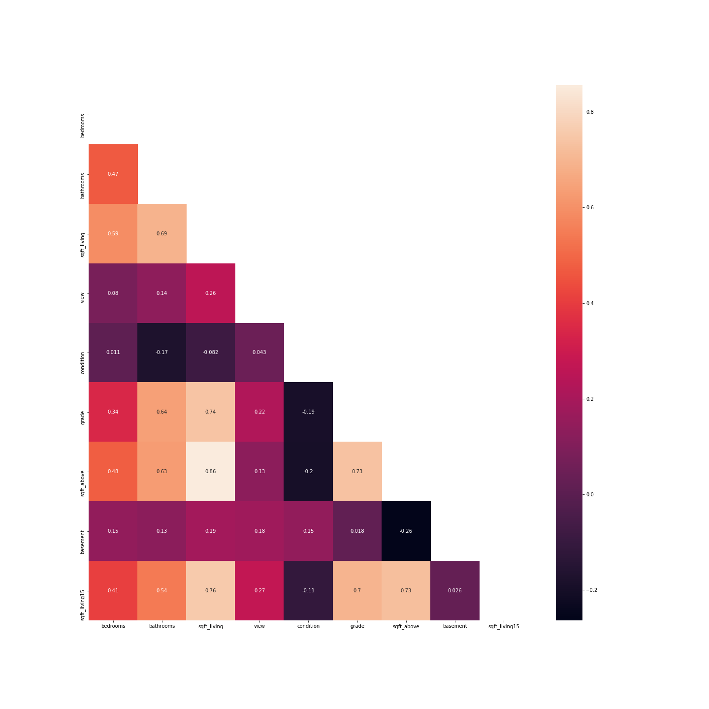
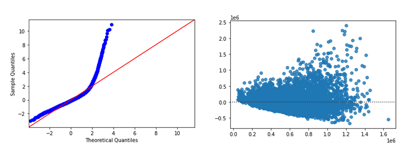

# King-County-Regression-Analysis

**Authors**: Wesley Yu

## Overview

This project will use multiple linear regression to analyze house sale prices in King County WA.

## Business Problem

A real estate company is looking to expand into the King County market. They want to know what kind of features will affect house prices in this area so that they can advise potential home buyers.

## Data

Data set from King County contains 21,597 records of house sales during 2014 - 2015 period. Data also contains sale prices, various features describing the homes, condition of property when sold, and location details. Additional data from US Post office was added to help narrow down zipcodes.

## Methods

Multiple linear regression analysis will be used to find relationship between various house features and sales price.

## Results

Linear regression is a great method to determine the strength of predictors. In order for linear regression to produce trustworthy results there are certain assumptions that need to be followed: 
* Linearity - relationship between predictor and target should be linear.
* Independence - Observations are independent from each other, low or no multicollinearity.
* Normality - Errors should be normally distributed
* Homoscedasticity - variance or the errors is the same

Checking for linearity between features and sales price.


Categorical varaibles can be checked with boxplots. sqft_living, grade, bathrooms, view, bedrooms, basement, and condition show to have a linear relation ship with sales price.


Overlaying house sales on map shows location has an effect on sales price as well.


Checking predictors for multicollinearity with a heatmap of correlation matrix.



Baseline model with the 2 highest correlated predictors. Results show that the regression equation was found to be statistically significant with p-value of the F stat at 0 and a R^2 value of 0.485. 


Checking for residual normality and homoscedasticity with QQplot and scatterplot. Baseline model shows that these 2 assumptions are not fulfilled. 



Log transformation of the dependent variable price and sqft_living will help satisfy these 2 assumptions.


Final model results with all predictors we have selected. Show location, building grade, buidling condition, and sqft_living to have the strongest relationship with the sale price of a house.


## Conclusions


- __Location, location, location__ Our final model showed that the biggest factor in house prices are location. results from analysis show as you move further away from Seattle, prices for a house with similar features decrease.

- __House Quality__ Aside from location, the next biggest factor in house prices are the condition and grade of the property.

- __House Features__ More rooms do not increase the price of a house if it does not increase livable sq footage.

 
## Next Steps

- __Limitations__ House prices can be subjective, certain people may be more willing to pay more than others for a specific house. Additional data can be introduced to see if there is a relationship between different types of buyers and house prices.

- __Timing__ Purchasing a house is a big investment, we can examine mortgage interest rates to see if lower interest rates effect house prices.


## For More Information

Please review our full analysis in [our Jupyter Notebook](./king-county-regression-analysis.ipynb) or our [presentation](./king-county-Presentation.pdf).

For any additional questions, please contact **Wesley Yu at to.wesleyyu@gmail.com**

## Repository Structure

```
├── README.md                           
├── king-county-regression-analysis.ipynb
├── king-county-Presentation .pdf        
├── data                                
└── images                              
```
